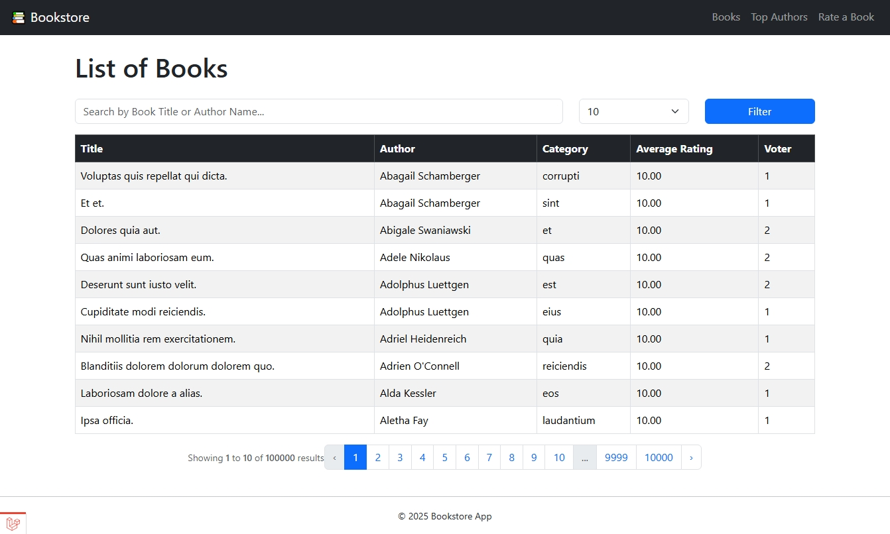

# 📚 Bookstore Management System

A backend web application built with Laravel 11 to manage a bookstore's collection, allowing customers to rate books and view top-rated books and authors. This project is optimized to handle large datasets efficiently using database denormalization techniques.

---

## 🚀 Features

1.  **📖 List of Books**
    * Displays top books by average rating (descending).
    * A single search input to filter by book title or author name.
    * Choose how many items to display per page (10–100).
    * Fully paginated results.

2.  **👨‍💼 Top 10 Most Famous Authors**
    * Sorted by the number of voters who gave a rating greater than 5.
    * Loads instantly due to pre-calculated voter counts.

3.  **⭐ Submit Book Rating**
    * Dynamic and user-friendly dropdowns: select an author first, and the book list will automatically populate with that author's books.
    * Rating scale from 1 to 10.
    * After submission, redirects to the book list page.

---

## ⚙️ Tech Stack & Key Concepts

-   PHP 8.2
-   Laravel 11
-   MySQL
-   **Database Denormalization**: Pre-calculating and storing `ratings_avg`, `voter_count` for books and authors to ensure high performance and avoid real-time calculation on large datasets.
-   Bootstrap 5 (CDN)
-   jQuery & Select2 (for dynamic and searchable dropdowns)

---

## 🧪 Requirements

-   PHP ≥ 8.2
-   Composer
-   MySQL database

---

## 📦 Installation Guide

1.  **Clone the repository**

    ```bash
    git clone [https://github.com/yourusername/bookstore.git](https://github.com/yourusername/bookstore.git)
    cd bookstore
    ```

2.  **Install dependencies**

    ```bash
    composer install
    ```

3.  **Setup `.env` file**

    Copy `.env.example` to `.env` and set your database credentials:

    ```bash
    cp .env.example .env
    ```

    Edit the `.env` file:
    ```env
    DB_CONNECTION=mysql
    DB_HOST=127.0.0.1
    DB_PORT=3306
    DB_DATABASE=your_db_name
    DB_USERNAME=your_db_user
    DB_PASSWORD=your_db_pass
    ```

4.  **Generate application key**

    ```bash
    php artisan key:generate
    ```

5.  **Run migrations & seeders**

    ```bash
    php artisan migrate:fresh --seed
    ```

    ⏳ This command will:
    1.  Create the database schema.
    2.  Seed the database with a large amount of fake data:
        -   1,000 authors
        -   3,000 categories
        -   100,000 books
        -   500,000 ratings
    3.  **Automatically run custom commands** (`books:calculate-ratings` and `authors:calculate-voters`) to pre-calculate and store aggregated data in the `books` and `authors` tables.

    > The seeding process might take a few minutes, which is normal due to the large volume of data and the calculation steps involved.

6.  **Run the development server**

    ```bash
    php artisan serve
    ```

7.  **Access the app**

    Open in browser: [http://localhost:8000](http://localhost:8000)

---

## 📷 Screenshots

| Feature | Preview |
| :--- | :--- |
| Book List |  |
| Top Authors |  |
| Rating Form |  |

---

## ⚠️ Notes

-   **Performance**: The application is designed to be highly performant by avoiding complex real-time aggregations. Average ratings and voter counts are pre-calculated and stored directly in their respective tables (`books` and `authors`). This ensures that pages load quickly, even with hundreds of thousands of records.
-   **No Cache**: As per the test instructions, no caching mechanisms (like Redis or Memcached) are used. The performance is achieved purely through database optimization.
-   **Database Seeding**: All sample data is generated using Laravel Factories and Seeders. No `.sql` dump file is needed.

---

## 📬 Contact

Created by [Dewandra](https://github.com/dewandra)  
📧 dewandrarb@gmail.com